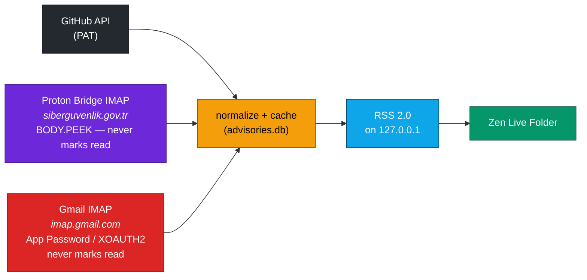
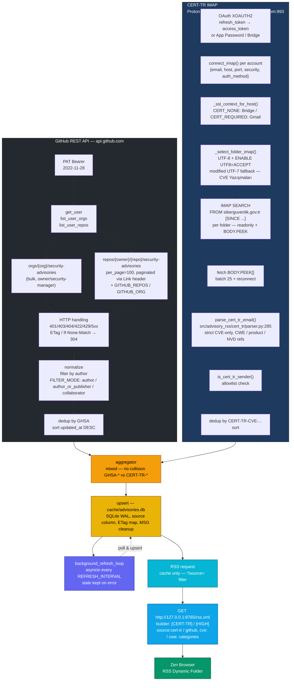

# Advisory-RSS - GitHub + CERT-TR (SGB)

Security-first local service that lists **GitHub Security Advisories created/owned by you** **and** **CERT-TR / T.C. Siber Güvenlik Başkanlığı advisories received via e-mail (Proton Bridge or Gmail)** and exposes them as a **single mixed RSS 2.0 feed** for Zen Browser's RSS Live Folder. What is 'Zen Browser's Live Folder?' == `https://github.com/zen-browser/desktop/releases/tag/1.19b`



**Endpoints:**

```
http://127.0.0.1:PORT/rss.xml              # mixed (GitHub + CERT-TR)
http://127.0.0.1:PORT/rss.xml?source=github
http://127.0.0.1:PORT/rss.xml?source=cert-tr
http://127.0.0.1:PORT/health               # per-source counts, cert_tr diag
http://127.0.0.1:PORT/                     # hint
```

---

## 1. Prerequisites

- **Python 3.12+**
- `uv` **or** `pip` + venv
- For GitHub source: a GitHub account that **owns/creates advisories** (you are `author`) + PAT (see §3)
- For CERT-TR source (optional, `ENABLE_CERT_TR=true`):
  - **Proton Mail** with **Bridge** installed (paid plan required, you can patch the source though) **or** **Gmail** with IMAP enabled
  - CERT-TR mails come from `cve@siberguvenlik.gov.tr` / `siberguvenlik.gov.tr` - only **CVE-assigned** mails are ingested (like `CVE ID Talebi`, `Zafiyet Bildiriminiz Hakkında` without CVE are skipped)
  - Proton: Bridge exposes localhost IMAP `127.0.0.1:1143` `STARTTLS` (self-signed)
  - Gmail: `imap.gmail.com:993` `SSL` via **App Password** (16 chars, 2FA required) **or** **OAuth 2.0** (`google-auth` + `google-auth-oauthlib`)

---

## 2. Installation

### 2.1 User Install

```bash
pip install advisory-rss
pipx install advisory-rss
```

### 2.2 Dev Install

```bash
git clone https://github.com/Lunixizm0/advisory-rss
cd advisory-rss

# with uv (recommended)
uv sync --extra dev
# or with pip
python -m venv .venv && source .venv/bin/activate
pip install -e .[dev]

# verify
app --help
app auth login --help
pytest -q   # 78 tests
ruff check && pyright  # All checks passed!
```

---

## 3. GitHub PAT

The service uses **official GitHub REST API** for the GitHub source.

| PAT type | Where to create | Scopes / Permissions required | When needed |
|---|---|---|---|
| **Fine-grained PAT (recommended)** | <https://github.com/settings/personal-access-tokens/new> | Resource owner: *your user + relevant orgs* - Repository access: *All repositories* (or select repos) - **Repository permissions - Security advisories: Read-only** + **Metadata: Read-only** (implied). For org-wide bulk fetch: **Organization permissions - Security advisories: Read-only** (requires org owner/security-manager). | Preferred - short expiry (30–90 days), no read to code. |
| **Classic PAT fallback** | <https://github.com/settings/tokens/new> | `repo` **or** at minimum `public_repo` (but **private/draft advisories require `repo`**). Docs: `repo` or `repository_advisories:read` (`docs.github.com/en/rest/security-advisories/repository-advisories`). | If fine-grained is unavailable. Note: `repo` grants read to code - broader than needed. |

**No other scopes are needed.** Do not grant `admin:org`, `delete_repo`, `workflow`, etc.

**GitHub API endpoints used:**

- `GET /user` - resolves authenticated `login`
- `GET /user/repos?affiliation=owner&visibility=all&per_page=100&sort=updated` - paginated enumerates repos you own
- `GET /user/orgs` - lists orgs you belong to
- `GET /orgs/{org}/security-advisories?per_page=100&sort=updated&state={triage,draft,published,closed}` - org-wide bulk (requires owner/security-manager, else 403/404 and we fall back to per-repo)
- `GET /repos/{owner}/{repo}/security-advisories?per_page=100&sort=updated&direction=desc&state={triage,draft,published,closed}` - primary fetch, paginated via `Link: <…after=…>; rel="next"` until exhaustion
- `GET /advisories/{ghsa_id}` - optional enrichment for published global view (not used for discovery)

**Why GraphQL is rejected for ownership:** `docs.github.com/en/graphql/reference/security-advisories` lists `securityAdvisories{ghsaId,summary,severity,…}` with args `classifications, epss*, first/last, identifier, orderBy, publishedSince` - **no `author` field and no author filter**, so it cannot identify "created by me" reliably. We use REST `author.login` and filter client-side.

---

## 4. CERT-TR / Gmail / Proton

### 4a. GitHub only (default)

```bash
cp .env.example .env
$EDITOR .env
# e.g. GITHUB_TOKEN=github_pat_…  or ghp_…
# leave BIND_ADDRESS=127.0.0.1 and PORT=8765 - do NOT change to 0.0.0.0

# validate PAT (only checks GET /user, never saves to file - .env is the only source)
app auth login --provider github
# Paste PAT -> "+ Validated as @you" -> choose to write to .env or set manually

# manual fetch - writes cache/advisories.db
app sync
app sync --source github   # only GitHub
app status
# - GitHub: 1  CERT-TR: 2  (if CERT-TR enabled)
```

**Direct fetch for advisories in repos you don't own** (you authored GHSA in `other-org/other-repo` but `affiliation=owner` doesn't list it - GitHub has no `author` filter, see Known Limitations):
```bash
# .env
GITHUB_REPOS=your-org/your-repo,other-org/other-repo   # comma-separated, always scanned
GITHUB_ORG=your-org                          # expands via /orgs/{org}/repos
SKIP_FULL_SCAN=true   # optional: skip scanning all owned repos, only scan GITHUB_REPOS/GITHUB_ORG (fast)
# PAT must have Repository access -> Selected repositories covering those repos (fine-grained)
LOG_LEVEL=INFO app sync
```

`FILTER_MODE` semantics, `.env.example:22`:

- `author` **(default)** - only `advisory.author.login == your_login` (precise "created by me")
- `author_or_publisher` - also matches `publisher.login`
- `author_or_collaborator` - also matches `collaborating_users[]` (covers advisories where you are collaborator but not author)

### 4b. CERT-TR via Proton Bridge

Bridge must be installed, logged in, and running (`protonmail-bridge --cli` - `info` shows host/port/password).

```bash
cp .env.example .env
$EDITOR .env

# interactive login (validates via IMAP SELECT, does not mark read)
app auth login --provider proton --email mail@mail.com
# Paste Bridge password -> "+ Proton IMAP doğrulandı"
# Writes PROTON_BRIDGE_EMAIL/PASSWORD (or appends to PROTON_BRIDGE_EMAILS) to .env

app sync --source cert-tr   # only CERT-TR
app sync --source all       # GitHub + CERT-TR mixed
app status  # shows CERT-TR accounts: [proton] mail@mail.com -> folder=INBOX host=127.0.0.1:1143
```

Bridge's IMAP is `127.0.0.1:1143` `STARTTLS` with self-signed cert (`CERT_NONE`), `BODY.PEEK` + `SELECT readonly=True` (never sets `\Seen`), reconnect every 25 mails (Bridge drops).

### 4c. CERT-TR via Gmail (App Password or OAuth)

**App Password (simplest, 2FA required):**

1. Gmail - Google Hesabı - Güvenlik - 2 Adımlı Doğrulama - Uygulama şifreleri - `Posta` - `Diğer` - `Advisory-RSS` - 16 haneli şifre (örn. `abcd efgh ijkl mnop`, boşluklar korunur).
2. Gmail - Ayarlar - Yönlendirme ve POP/IMAP - IMAP'ı etkinleştir.

```bash
app auth login --provider gmail --method app-password --email mail@mail.com
# Paste App Password -> "+ Gmail IMAP (App Password) doğrulandı"
```

**OAuth 2.0 (recommended for long-lived, no app password):**

1. <https://console.cloud.google.com/> - Create Project - APIs & Services - Credentials - Create Credentials - OAuth Client ID - Application type: **Desktop** - Name: `Advisory-RSS` - Create - copy `Client ID` / `Client Secret`.
2. Enable **Gmail API**: APIs & Services - Enable APIs - search `Gmail API` - Enable.
3. The CLI will open browser for consent (`https://mail.google.com/` scope, `access_type=offline` `prompt=consent` to get `refresh_token`).

```bash
app auth login --provider gmail --method oauth --email mail@mail.com
```

---

## 5. Starting the Server

```bash
app serve
# binds 127.0.0.1:8765, background refresh every REFRESH_INTERVAL (default 600s = 10 min) for BOTH sources
# health: curl http://127.0.0.1:8765/health | jq
# feed  : curl http://127.0.0.1:8765/rss.xml | xmllint --noout -
# filter: curl "http://127.0.0.1:8765/rss.xml?source=cert-tr" | xmllint --noout -
```

## 6. RSS URL

Canonical for Zen Browser (mixed):

```
http://127.0.0.1:8765/rss.xml
http://127.0.0.1:8765/rss.xml?source=github
http://127.0.0.1:8765/rss.xml?source=cert-tr
```

Do not use HTTPS. Also, no auth on `/rss.xml` (Zen has no RSS auth). Mixed feed title: `Security Advisories (GitHub + CERT-TR) - @you`, per-source: `[CERT-TR] pardus-etap-settings: CVE-2026-92083 (CWE-862)`.

## 7. Adding the Feed to Zen Browser RSS Dynamic Folder

1. Start the feed: `app serve` and verify `curl http://127.0.0.1:8765/rss.xml | head` returns `<rss version="2.0">`.
2. Open Zen Browser - **Right Click - Live Folder - Add RSS Feed**
3. Paste **`http://127.0.0.1:8765/rss.xml`** as the feed source. Leave protocol HTTP (not HTTPS).
4. Save. Advisories appear sorted `updated_at DESC`, newest first. Withdrawn advisories remain with `[WITHDRAWN]` prefix - not deleted. CERT-TR items have `[CERT-TR]` prefix, NVD link, `source:cert-tr`/`cve:`/`cwe:` categories.
5. If Zen shows empty folder: `curl http://127.0.0.1:8765/health | jq .advisories_count,.github_count,.cert_tr_count` should be >0; if 0, re-run `app sync` and check `app status` for rate-limit/auth errors.

---

## 8. Changing the Refresh Interval

```bash
# .env
REFRESH_INTERVAL=300   # 5 minutes, min 60
# and optionally
MAX_ITEMS=500          # RSS truncation (cache still retains all to avoid missing advisories)
```

Restart `app serve` to apply. The feed `Cache-Control: private, max-age=300, must-revalidate` and `<ttl>5</ttl>` update automatically. `app status` shows `Next scheduled sync`. `background_refresh_loop` `src/advisory_rss/server/app.py:346` polls both GitHub (`If-None-Match`/`ETag`) and CERT-TR (`IMAP` `BODY.PEEK`) every interval, `asyncio.to_thread` for IMAP, stale kept on error.

## 8b. Keep running after closing the terminal (`--daemon`)

Normal `app serve` dies when the terminal closes (SIGHUP). If you want it to keep running in the background:

```bash
# easiest - daemonize (double-fork + setsid, like nohup but with pid/log management)
app serve --daemon
# - pid: cache/advisory-rss.pid , log: cache/serve.log
# verification
cat cache/advisory-rss.pid
ps -p $(cat cache/advisory-rss.pid) -o pid,cmd
curl http://127.0.0.1:8765/health
tail -f cache/serve.log
app stop                # SIGTERM + pid cleanup
app stop --pid-file cache/advisory-rss.pid

# alternatives (without daemon):
nohup app serve > cache/serve.log 2>&1 & disown
# or
tmux new -s rss "app serve"
# or systemd user service (persistent)
# ~/.config/systemd/user/advisory-rss.service:
# [Unit] Description=Advisory RSS localhost-only
# [Service] ExecStart=%h/Belgeler/Projeler/Advisory-RSS/.venv/bin/python -m advisory_rss.cli serve
#           Restart=always
#           Environment=GITHUB_TOKEN=ghp_...
# [Install] WantedBy=default.target
# systemctl --user daemon-reload && systemctl --user enable --now advisory-rss
```

Background behaviour: RSS reads cache only; a background task polls **both** sources every `REFRESH_INTERVAL`, uses `If-None-Match`/`ETag` for GitHub and `BODY.PEEK`/`readonly=True` for IMAP, and **keeps stale cache on transient errors** (requirement: feed stays available if GitHub/Gmail/Proton is down).

---

## 9. Troubleshooting

| Symptom | Check |
|---|---|
| `401 Unauthorized` at `app sync` | PAT expired/revoked or empty. Re-run `app auth login --provider github`; verify at <https://github.com/settings/tokens>. See Health `last_error`. |
| `403 Forbidden` | PAT scopes missing `repository_advisories:read` or org role insufficient (org bulk needs owner/security-manager - falls back to per-repo). Log shows scope hint. |
| `429 / rate limited` | `health.rate_limited_until` set, `app status` shows it. Wait or raise `MAX_REPOS`/reduce `REFRESH_INTERVAL` frequency. Logs include `Retry-After`/`X-RateLimit-Reset`. |
| `404` for a repo | Repo not found or no advisories - skipped, not fatal. |
| `422 Validation` | GitHub rejected params (e.g., bad state) - logged and skipped. |
| Feed empty but advisories exist | Check `FILTER_MODE` (default `author` requires you are `author`. Try `author_or_publisher`). Also ensure `authenticated_user` in `app status` equals your advisory author. For CERT-TR: check `ENABLE_CERT_TR=true` and `app status` - `CERT-TR accounts: N` and `IMAP search empty` - folder name wrong? Try `GMAIL_IMAP_FOLDERS=INBOX` only, or check `LOG_LEVEL=DEBUG app sync`. |
| `IMAP login failed` (Proton) | Bridge running? `127.0.0.1:1143` reachable? `protonmail-bridge --cli` - `info` shows correct host/port/password. Password is **Bridge password**, not account password. Check `PROTON_BRIDGE_HOST/PORT/SECURITY`. |
| `IMAP login failed` (Gmail App Password) | 2FA enabled? App Passwords - generate new 16-char (spaces preserved). Gmail - Settings - Forwarding and POP/IMAP - IMAP enabled. Check `GMAIL_IMAP_HOST=imap.gmail.com:993 SSL`. |
| `IMAP XOAUTH2 failed` (Gmail OAuth) | `GMAIL_OAUTH_CLIENT_ID/SECRET` correct? Refresh token expired/revoked? Re-run `app auth login --provider gmail --method oauth`. Check `cache/gmail_oauth.json` exists (`chmod 600`). Ensure Gmail API enabled in Google Cloud. Check `LOG_LEVEL=DEBUG` for `fetch_access_token` error. `https://oauth2.googleapis.com/token` must be reachable. |
| `UnicodeEncodeError: ascii ... Yazışmaları` | Fixed in `src/advisory_rss/cert_tr/imap.py:24` via `modified UTF-7` fallback + `mail._encoding='utf-8'` + `ENABLE UTF8=ACCEPT`. Ensure `GMAIL_IMAP_FOLDERS` uses `,` as separator (not `;` + space split) and folder name exactly as in Gmail UI (case-sensitive). Try `LOG_LEVEL=DEBUG app sync --source cert-tr` to see `IMAP select folder`. |
| `CERT-TR sync: no advisories (raw 0)` | `CERT_TR_SENDER_ALLOWLIST=siberguvenlik.gov.tr` correct? Check `IMAP search empty` - folder empty or `FROM` mismatch. Try `GMAIL_IMAP_FOLDERS=INBOX` and check Gmail for mails from `cve@siberguvenlik.gov.tr`. `CERT_TR_MAX_MAILS` maybe too low? `CERT_TR_SEARCH_DAYS` maybe filtering? |
| `CERT-TR sync OK - 0 advisories ... parsed 0` but raw >0 | All mails without CVE are now **skipped** (CVE-only). Check `health` - `cert_tr_count` should be 2 for your `CVE-2026-92083/16245`. Old `CERT-TR-MSG-*` rows auto-deleted on next `CacheStore` init `src/advisory_rss/cache/store.py:76`. |
| `pip-audit` failure | `pip install pip-audit && pip-audit` - fix by bumping pinned dep in `pyproject.toml`. |
| `google-auth-oauthlib` missing | `uv sync --extra dev` or `pip install google-auth google-auth-oauthlib` (added to `pyproject.toml:9`). |

View logs: `LOG_LEVEL=DEBUG app serve` for detail (still redacted).

Verify feed: `xmllint --noout <(curl -s http://127.0.0.1:8765/rss.xml)` - no output means valid. Check per-source: `curl -s "http://127.0.0.1:8765/rss.xml?source=cert-tr" | grep CERT-TR`.

---

## Architecture Explanation



Key invariants: RSS reads cache only; GH enumeration is exhaustive; IMAP never sets `\Seen`; failures keep stale cache; `CERT-TR` strict CVE-only (hash fallback removed).

---

## Required Scopes/Permissions (Recap)

- **GitHub Fine-grained:** `Repository security advisories: Read`, `Metadata: Read`, (org bulk: `Organization security advisories: Read`)
- **GitHub Classic:** `repo` (or `public_repo` for public advisories only, but private/draft need `repo` / `repository_advisories:read`)
- **Proton Bridge:** Bridge must be running, `PROTON_BRIDGE_PASSWORD` is Bridge-generated (Mailbox details), not account password, paid plan required
- **Gmail App Password:** Google Account - 2FA - App Passwords - `GMAIL_APP_PASSWORD` (16 chars, spaces preserved), IMAP enabled
- **Gmail OAuth:** Google Cloud - OAuth Client ID (Desktop) - `GMAIL_OAUTH_CLIENT_ID`/`SECRET` - `app auth login --provider gmail --method oauth` - `refresh_token` stored in `cache/gmail_oauth.json` (600) + `.env` (`GMAIL_OAUTH_REFRESH_TOKEN(S)`), scope `https://mail.google.com/`, uses `XOAUTH2` `src/advisory_rss/auth/gmail.py:1` + `src/advisory_rss/cert_tr/imap.py:65`

---

## Known Limitations

- **GitHub No server-side "created by me" filter** - all filtering is client-side after listing advisories per repo/state. Costs API calls (~1 per repo × 4 states + org bulk) and is rate-limited; mitigated with ETag 304, pagination caps, and background polling rather than per-RSS-call.
- **GitHub Enumeration requires listing all owned repos** (`GET /user/repos`) - large accounts (thousands of repos) need many pages; `MAX_REPOS`/`MAX_PAGES_PER_REPO` cap prevents runaway, `app status` reports caps hit.
- **GitHub Org bulk requires owner/security-manager** - else 403/404 per org and we fall back to per-repo enumeration (expected).
- **GitHub Global `GET /advisories` cannot tell ownership** - it is the public advisory database; ignored for discovery, used only as optional enrichment if needed.
- **GHSA != chronological** - must sort by `updated_at`, not ID.
- **GraphQL `SecurityAdvisory` has no `author`** - verified; cannot replace REST for this use case.
- **Global enrichment 404 for draft/private** - expected; we treat missing as not-enriched.
- **Withdrawn state** differs between global (`withdrawn_at`/`is_withdrawn`) and repo (`state: closed/withdrawn` + `withdrawn_at`) - normalized into single `withdrawn_at`/`state`.
- **CERT-TR IMAP `FROM` search is substring** - `FROM "siberguvenlik.gov.tr"` is server-side substring, but final `is_cert_tr_sender()` `src/advisory_rss/cert_tr/parser.py:429` does strict domain check; non-CVE mails are now skipped entirely.
- **Gmail/Proton folders with non-ASCII** (e.g., `CVE Yazışmaları`) require `modified UTF-7` fallback `src/advisory_rss/cert_tr/imap.py:24`; `GMAIL_IMAP_FOLDERS` must be comma-separated (spaces preserved), not whitespace-split.
- **Gmail OAuth `refresh_token` only on first consent** - if `run_gmail_oauth_flow` `src/advisory_rss/auth/gmail.py:210` returns no `refresh_token`, revoke access at <https://myaccount.google.com/permissions> and retry with `prompt=consent`.
- **Proton Bridge self-signed cert** - `CERT_NONE` + `STARTTLS` (or `SSL`); Gmail uses `CERT_REQUIRED`.
- **Legacy `CERT-TR-MSG-*` rows** - auto-deleted on `CacheStore` init `src/advisory_rss/cache/store.py:76` (non-CVE false positives).

---

## Development & Tests

```bash
pytest -q                     # 78 tests (60 original + 14 CERT-TR + 4 Gmail)
pytest tests/unit -q -v
pytest tests/integration -v   # starts ephemeral server on 127.0.0.1:0, validates RSS & headers
pytest tests/unit/test_cert_tr_settings.py tests/unit/test_cert_tr_imap.py -v  # Gmail/Proton multi-folder, OAuth
pip-audit                     # audit scan

# Regenerate real fixtures from live GitHub API (uses GITHUB_TOKEN from .env, auto-detects GITHUB_REPOS/GITHUB_ORG/SKIP_FULL_SCAN)
python scripts/fixtures_generator.py
python scripts/fixtures_generator.py --ghsa GHSA-xxxx-xxxx-xxxx --repo bla/bla  # single GHSA

# Lint / type-check (no noqa, truly fixed)
ruff check                    # All checks passed!
pyright                       # 0 errors, typeCheckingMode: standard, extraPaths: ["src"]
```

## License

GNU